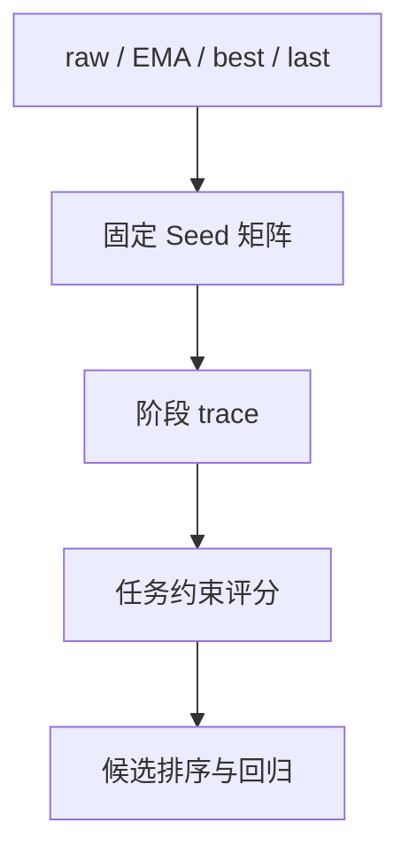

## validation loss 不是闭环指标

ACT 训练中同时存在 raw、EMA、best 和 last checkpoint。validation selection loss 只衡量离线动作重建，不能回答策略是否在固定场景中完成抓取、抬升和放置。报告中的 T4 训练完成 6500 epoch，best raw 的 selection loss 为 `0.106784`，best EMA 为 `0.118849`；这两项结果都不能直接写成 rollout 成功率。

更稳妥的模型选择协议是：保留所有候选，在同一份 Seed manifest 上运行，统一记录 checkpoint、任务、Seed、执行频率、chunk size、temporal aggregation 和结果 JSON，再按闭环表现和失败阶段选择部署候选。

## 固定 Seed 才能比较 checkpoint

每个 checkpoint 使用不同随机场景时，成功率差异同时包含策略变化和场景变化。固定 Seed 后，物体初态、相机扰动和任务参数保持一致，才能把差异归因于模型。评测 runner 还应校验任务绑定，阻止 T3 权重被误用于 T4。

评测分两阶段更节省预算：先在 3–5 个 Seed 上检查启动、NaN、动作范围和任务绑定；通过后再扩大 Seed 数，报告成功率和失败阶段分布。执行频率、chunk size 与 temporal aggregation 属于独立变量，应单独消融，不能和 checkpoint 选择混在一次实验里。

## 失败分层比一个布尔值更有信息

双臂堆叠的 `success=false` 可能来自完全不同的原因。将 trace 拆成 `contact / wrist / approach / grasp / lift / place` 后，才能把结果映射到工程修改：

| 阶段 | 诊断重点 | 典型修复 |
| --- | --- | --- |
| approach | 可达性、路径长度、碰撞 | 调整候选或缩短路径 |
| grasp | 接触点、腕部姿态、夹爪开度 | 修正几何约束 |
| lift | 双侧接触与受力平衡 | 检查夹爪和抬升方向 |
| place | live XY、释放高度、对齐误差 | 重新计算目标 |

T1–T3 使用二元 Success Rate；T4 在 episode 结束时一次性计算 `0/3、1/3、2/3、3/3` 分层进度，并加入锚点、层高、最小层间距和夹爪张开约束。按仿真 step 重复平均会放大长轨迹的权重，也可能把夹持悬停误判为成功。

## 让采集管线可以中断后继续

长时序演示的可复现性取决于采集脚本是否能恢复。`episode_num` 只能表示已通过终态检查并完成写盘的成功轨迹；失败 Seed 仍递增并记录阶段，避免恢复时无限重试同一个不可达场景。

单次执行先写临时 HDF5，关闭后重新打开检查 `qpos/action` 长度、16 维状态、三相机帧数和有限值，再在锁保护下原子合并到训练目录。损坏文件、碰撞轨迹、错误动作顺序、长时间停顿和抖动轨迹进入 rejected manifest，不应靠转换脚本的 mask 混入训练集。

训练入口要保存配置快照、日志路径和完成标记，并区分权重 warm-start 与包含 optimizer、scheduler、EMA 状态的 bit-exact resume。跨工作区迁移使用相对路径 SHA-256 清单，只补入缺失文件并保留已有文件快照；报告记录为 39 个缺失脚本/配置、0 个哈希不匹配。

## 可发表的结论边界

Expert 采集率、validation loss 和 policy rollout SR 属于三个层次，不能互相替代。固定 Seed 协议的意义，正是把每个数字绑定到明确的对象、数据划分和执行条件上。只有当 checkpoint、场景、控制频率和评分口径都一致时，成功率差异才足以支持模型选择或消融结论。

