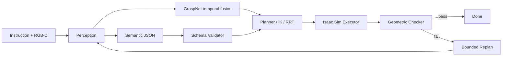

## 先定义 VLM 的权限

在机器人系统里，VLM 适合回答“要做什么”，不适合直接输出关节角、IK 解或碰撞约束下的轨迹。AuraVLA 将 VLM 输出限制在对象、目标、任务类型和少量属性；运动学、碰撞和抓取姿态由确定性模块重新计算。



`pose`、`trajectory`、`joint_positions`、`velocity` 和 `waypoints` 等底层字段在 Schema 层拒绝，避免模型绕过规划器直接控制执行器。

## 语义契约必须可验证

规划输入是带版本和动作白名单的任务计划。当前执行接口围绕 `pick_and_place`，动作包含 `action_id`、`task`、`object_name` 和 `target_name`。空计划、未知动作或禁用运动字段立即失败。

执行器只消费通过 Schema 的高层动作，再根据当前 USD 场景计算 grounding、IK、RRT 和夹爪姿态。这样可以区分结构错误、权限错误和目标 grounding 错误。

## Grounding 是独立接口

名称规范化不能证明场景中存在唯一实体。对象映射到 USD Prim 前还要检查 Prim 存在且可见、同名对象是否需要消歧，以及视觉置信度是否达到执行阈值。感知层应返回稳定实体标识和候选置信度，而不是把字符串直接交给执行器。

抓取候选还要经过短时 RGB-D 融合：AuraVLA 采集三帧 GraspNet 观测，结合深度质量与包围盒有效性做加权，并用 Median/MAD 和姿态离散度检查剔除异常帧。融合器拒绝不一致结果，不把单帧候选作为静默回退；通过后才交给夹爪几何验收与 Lula IK/RRT。

## 编排器是有限状态机

任务生命周期包括 `EVALUATING`、`PLANNING`、`EXECUTING`、`CHECKING`、`REPLANNING` 和终态。每次执行保留 attempt 记录，几何验收失败时把结构化错误带入下一轮，并限制重规划次数。

当前仓库中的 `Orchestrator` 保留状态转移和错误记录接口，部分服务方法仍是调用桩；真正的 Isaac Sim 执行链路位于 `aura_execution`、`aura_verification` 和 `aura_hardware`。架构已定义不能等同于端到端 benchmark 已完成。

## 验收不能只看执行返回值

动作接口返回成功只说明控制调用没有抛异常。验证模块还要检查物体是否位于容器可用区域、物体高度是否高于桌面、放置后速度是否稳定，以及抓取时物体是否随夹爪抬升。

```json
{
  "success": false,
  "stage": "verification",
  "reason_code": "PLACE_OUTSIDE",
  "entity_id": "banana_01",
  "attempt": 2,
  "replan_allowed": true
}
```

`reason_code` 便于回归统计，也避免把内部异常栈直接反馈给 VLM。

## 可复现性

每次任务应保存原始指令、grounding 结果、Schema 版本、计划 JSON、执行状态、验收结果和重规划上下文。只记录最终 success，无法判断改进来自模型、规划器、物理参数还是验收阈值。

AuraVLA 的工程重点是把 VLM 放在低权限语义入口，把几何、运动学、碰撞和终态验证留在可测试边界内。
