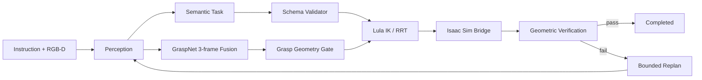

## 项目定位

AuraVLA（Autonomous Unified Robotic Agent with Vision-Language-Action）面向桌面双臂操作，将自然语言任务转换为可验证的机器人动作。项目的核心不是让 VLM 直接控制关节，而是把不确定性限制在语义入口，把抓取几何、运动学、碰撞和终态检查放在可测试的确定性模块中。

系统闭环为：

**Perception → Planning → Execution → Verification → Replanning**

每次任务都需要保留输入指令、场景 grounding、Schema 版本、动作计划、执行状态和验证结果；只有最终 `success` 而没有失败阶段，无法支持工程回归。

## 系统数据流



语义计划和抓取观测在进入规划器前分别验收。这样可以区分“任务含义不完整”“视觉候选不稳定”“夹爪几何不可行”和“运动空间不可达”，而不是把所有问题归因于 VLM。

## 语义层：VLM 只决定做什么

`aura_perception` 负责 VLM 调用、可行性评估和场景名称规范化。输出只允许描述 `pick_and_place` 等高层动作；`aura_planning/config/planning.yaml` 和 `schema_validator.py` 递归拒绝 `pose`、`trajectory`、`ik`、`joint_positions`、`velocity`、`waypoints` 等底层控制字段。

Schema 校验还会检查空动作、未知任务、空对象名和空目标名。解析 Markdown 代码块只解决格式噪声，不能替代完整结构校验。通过后的动作仍需根据当前 USD 场景重新计算抓取位姿和放置目标。

## 感知层：从候选到观测

GraspNet 结果不是最终抓取指令。当前实现每次采集三帧 RGB-D，以 `score × depth_quality × geometric_validity` 计算观测质量，并用 Median/MAD 剔除位置异常值；姿态先做四元数半球对齐，再进行 Markley 平均。

融合器同时返回接受/拒绝帧数、位置离散度、姿态离散度和 confidence。位置离散度超过 `0.025 m`、姿态离散度超过 `25°` 或 confidence 低于 `0.10` 时直接拒绝，不回退到不可靠的单帧结果。GraspNet 和 SAM 使用运行时缓存，VLM 不参与抓取点校准。

融合通过后仍需经过夹爪闭合轴、开口宽度、目标包围盒和最大 `15°` 抓取倾角检查；这层保护解决的是“候选稳定”，不是“夹爪一定能夹住”。

## 规划层：运动约束优先于模型输出

`aura_planning` 生成高层动作对应的目标位姿，`aura_hardware` 中的 Lula IK/RRT 再结合机器人当前关节、碰撞几何和夹爪约束求解路径。SparseKeyposeDiffuser 把稀疏关键姿态转换为连续轨迹，minimum-jerk 插值降低 RRT 转角处的速度突变。

双臂轨迹逐帧检查 TCP 最小间距；固定抓取姿态无法同时满足可达性和碰撞约束时返回失败，不通过改变腕部方向静默绕过约束。规划成功也只表示路径存在，不能替代接触和放置后的几何验证。

## 执行层：可恢复的 Isaac Sim 边界

`aura_execution` 通过文件桥接与 Isaac Sim 通信：请求、响应和状态分别写入 JSON 文件，正式文件使用临时文件加 `os.replace()` 原子替换。`request_id`、Owner Token 和 heartbeat 用来阻止旧请求重复执行，并区分 `ready`、`executing`、`error` 和 idle 状态。

执行配置中的桥接超时为 `300 s`、轮询间隔为 `0.5 s`，动作最多重试 `2` 次。重试只覆盖可恢复的桥接或规划错误；几何验收失败必须携带结构化原因进入有界重规划，不能无限重复同一路径。

## 验证层：成功必须有物理证据

`aura_verification` 在动作返回后检查对象是否处于容器可用区域、物体是否高于桌面、接触是否成立、放置后速度是否稳定，以及物体是否随夹爪抬升。夹爪接触采用指令位置与实际位置残差，连续多帧满足阈值后才进入抬升。

因此，动作接口没有抛异常不等于任务成功。建议将结果写成结构化记录：

```json
{
  "success": false,
  "stage": "verification",
  "reason_code": "GRASP_ALIGNMENT",
  "entity_id": "banana_01",
  "attempt": 2,
  "replan_allowed": true
}
```

真实失败也应保留。例如香蕉任务在夹爪轴对齐检查中记录 `alignment=0.879` 时应安全停止；这表示未达到阈值，不是成功率。蓝色罐头在 Lula 完整抓取与抬升可达性检查处停止，则应归因于标定或工作空间，而不是隐藏成感知成功。

## 代码边界与验证口径

| 层级 | 代码位置 | 主要责任 | 可验证证据 |
| --- | --- | --- | --- |
| 感知 | `aura_perception/`、`aura_hardware/aura_isaac_bridge/core/grasp_fusion.py` | 语义解析、RGB-D、抓取融合 | 帧一致性、离散度、confidence |
| 规划 | `aura_planning/`、Lula/Curobo 配置 | Schema、IK、RRT、碰撞 | 禁止字段测试、规划状态 |
| 执行 | `aura_execution/`、Isaac bridge | 请求幂等、轨迹执行 | request/response/status |
| 验证 | `aura_verification/` | 接触、包容、抬升和放置 | reason code、终态几何 |

目前已验证的 GraspNet 融合与运动规划测试共 `7 passed`，并通过 `py_compile` 与 `git diff --check`；Isaac Sim VS Code Edition 热重载后任务桥和相机桥正常。上述结果证明的是模块边界和安全停止行为，不是端到端 benchmark 成绩。

## 结论

AuraVLA 的项目级价值在于把 VLA 系统拆成可审计的职责边界：VLM 负责泛化的任务语义，GraspNet 提供带一致性证据的候选，规划器负责运动约束，Isaac Sim 负责执行，验证器负责决定任务是否真的完成。这样的闭环允许系统在不确定时停止，并把失败归因到可修复的模块，而不是用一条模糊的“执行失败”覆盖整个链路。
