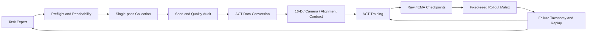

## 项目背景

双臂机器人在长时序操作任务中面临数据链路的误差耦合问题：Expert 规划失败、接触点选择错误、动作与状态错位、相机顺序漂移、失败样本污染等。本项目基于 Tron2 双臂机器人平台，构建了 `Expert → Data → ACT → Evaluation` 的闭环优化系统。

项目覆盖四类递增难度任务：单臂瓶体调整（T1）、双臂滚筒抓举（T2）、双碗堆叠（T3）和三碗长时序堆叠（T4）。通过基于运行日志的故障定位、固定 Seed 回归测试、数据契约检查和任务阶段化优化，形成了完整的训练与评测基础设施。

**技术栈：** Python · PyTorch · ACT · RoboTwin · SAPIEN · cuRobo · HDF5

## 系统架构



这套闭环将 Expert 失败、数据问题、模型误差和部署问题分开诊断，避免用增加 epoch 或扩大数据量掩盖上游缺陷。

## 核心技术贡献

### 1. ACT 数据契约与 Fail-Loud 校验

针对双臂机器人的特殊性，建立了严格的数据契约层，确保训练前发现所有潜在的数据质量问题：

#### 状态-动作时序对齐

ACT 模仿学习的核心假设是 `action[t]` 应该驱动系统从 `qpos[t]` 转移到 `qpos[t+1]`。数据处理中的时间步偏移会导致模型学习到近似 no-op 或滞后控制。项目实现了显式的 next-state 语义校验：

```python
# 训练前强制检查
def validate_action_qpos_alignment(hdf5_path):
    with h5py.File(hdf5_path, 'r') as f:
        for episode_key in f.keys():
            qpos = f[episode_key]['qpos'][:]
            action = f[episode_key]['action'][:]
            # 验证 action[t] == qpos[t+1]
            alignment_error = np.abs(action[:-1] - qpos[1:]).max()
            if alignment_error > THRESHOLD:
                raise ValueError(f"Action-qpos misalignment in {episode_key}")
```

#### 双臂 16 维状态空间

Tron2 双臂机器人的状态和动作空间为 16 维：`2 × (7 arm DoF + 1 gripper)`。训练和部署必须使用完全一致的维度定义：

- 维度顺序：先右臂 8 维，后左臂 8 维
- 数值范围：关节位置归一化到 `[-1, 1]`，夹爪开度 `[0, 1]`
- 有限性检查：拒绝包含 NaN 或 Inf 的轨迹

#### 三相机语义顺序

ACT 按张量位置索引消费图像特征，相机顺序错误不会触发 shape error，却会造成严重的语义错位。项目在三处固定相机顺序：

1. **数据配置**：HDF5 中按 `[head_camera, right_wrist_camera, left_wrist_camera]` 顺序存储
2. **训练 DataLoader**：显式检查并强制相机名称顺序
3. **部署 Policy**：rollout 时按相同顺序读取观测

```python
CAMERA_ORDER = ['head_camera', 'right_wrist_camera', 'left_wrist_camera']

def check_camera_order(dataset):
    actual_order = dataset.camera_names
    if actual_order != CAMERA_ORDER:
        raise ValueError(f"Camera order mismatch: {actual_order} != {CAMERA_ORDER}")
```

### 2. ACT 训练策略的任务自适应优化

针对不同难度的任务，设计了差异化的训练配置：

| 配置项 | T1 单臂调整 | T2 长时训练 | T2 Fine-tune | T3 双碗堆叠 | T4 三碗堆叠 |
|---|---:|---:|---:|---:|---:|
| 演示数据量 | 200 | 200 | 200 | 200 | 300 |
| 训练轮数 | 6000 | 6500 | 3000→5000 | 6000 | 6500 |
| Batch Size | 8 | 16 | 32 | 16 | 24 |
| KL 权重 | 10 | 1.0 | 1.0 | 10 | 2.0 (500 warmup) |
| Chunk Size | 50 | 100 | 100 | 50 | 100 |
| Policy LR | 1×10⁻⁵ | 2×10⁻⁵ | 8×10⁻⁶ | 1×10⁻⁵ | 1.5×10⁻⁵ |
| Backbone LR | 1×10⁻⁵ | 1×10⁻⁵ | 2×10⁻⁶ | 1×10⁻⁵ | 3×10⁻⁶ |
| EMA 系数 | 0.999 | 0.999 | 0.9995 | 0.999 | 0.9995 |

#### KL 权重的 Warmup 策略

对于 T4 三碗堆叠这种长时序任务，采用了 KL 权重渐进增加策略：

- **前 500 epoch**：KL 权重从 0 线性增加到 2.0，允许潜变量探索动作空间
- **后续训练**：固定 KL=2.0，在动作重建和潜变量正则之间平衡

这种策略避免了训练早期过强的正则导致模型陷入保守动作。

#### 学习率的分层设计

视觉 Backbone（ResNet-18）和 Transformer Policy 使用不同的学习率：

- **Backbone LR**：3×10⁻⁶，保持预训练特征稳定
- **Policy LR**：1.5×10⁻⁵，让策略层快速适应任务

这种分层设计在保留视觉特征通用性的同时，让策略层有足够学习能力。

#### EMA 权重的高系数配置

使用 0.9995 的高 EMA 系数，相当于对约 2000 个 batch 的权重进行指数移动平均：

```python
# EMA 更新
ema_param = ema_coeff * ema_param + (1 - ema_coeff) * train_param
```

高 EMA 系数产生的模型更稳定，在 rollout 时表现出更好的闭环鲁棒性。

### 3. Keyframe-Aware 数据采样

长时序轨迹中的关键帧（grasp、release、alignment）占比较低，随机采样容易被 approach 阶段淹没。项目实现了关键帧感知采样：

```python
def keyframe_aware_sampling(episode, keyframe_ratio=0.30):
    """
    30% 概率从关键帧附近采样，70% 从全轨迹均匀采样
    """
    if random.random() < keyframe_ratio:
        # 识别关键帧：夹爪状态变化 + 速度峰值
        keyframe_indices = detect_keyframes(episode)
        center = random.choice(keyframe_indices)
        start_idx = max(0, center - 10 + random.randint(0, 20))
    else:
        start_idx = random.randint(0, len(episode) - chunk_size)

    return episode[start_idx : start_idx + chunk_size]
```

这种采样策略让模型更频繁地看到关键操作时刻。

### 4. Expert 轨迹的阶段化优化

以 T4 三碗堆叠为例，将任务分解为多个子阶段，针对每个阶段设计失败恢复机制：

#### 抓取候选的 Native-First 策略

```python
def generate_grasp_candidates(bowl_pose):
    candidates = []

    # 1. Native top-down 抓取（优先级最高）
    candidates.append(generate_top_down_grasp(bowl_pose, wrist_tilt=0))

    # 2. 腕部倾斜的 fallback（15°）
    candidates.append(generate_top_down_grasp(bowl_pose, wrist_tilt=15))

    # 3. 侧向抓取（备选）
    candidates.append(generate_side_grasp(bowl_pose))

    return candidates
```

当 approach 成功但 grasp pose 失败时，继续尝试下一个候选。

#### 实时放置对齐

Move 2/3 在放置前重新读取支撑碗的实时位姿，使用 live XY 对齐：

```python
def place_bowl_on_stack(robot, bowl, stack):
    # 读取支撑碗的实时位姿
    support_bowl_pose = stack.get_top_bowl_pose()

    # 使用实时 XY 对齐
    target_pose = Pose(
        position=[support_bowl_pose.p[0], support_bowl_pose.p[1],
                  support_bowl_pose.p[2] + BOWL_HEIGHT],
        orientation=support_bowl_pose.q
    )

    robot.move_to(target_pose)
```

这种设计将三碗堆叠的累积误差从链式传播降低为依赖当前支撑层的局部误差。

### 5. 模型选择的多维度评估

**核心原则：Validation Loss 不等于 Rollout Success Rate。**

项目保留了多类 checkpoint 候选：

- **Raw Weights**：训练过程中的原始权重
- **EMA Weights**：指数移动平均权重
- **Best Checkpoint**：validation loss 最低点
- **Last Checkpoint**：训练终点

最终模型选择需结合固定 Seed rollout 的实际成功率：

```python
def select_best_policy(checkpoints, eval_seeds):
    results = []
    for ckpt in checkpoints:
        policy = load_policy(ckpt)
        success_rate = evaluate_on_seeds(policy, eval_seeds)
        results.append({
            'checkpoint': ckpt,
            'val_loss': ckpt.validation_loss,
            'success_rate': success_rate
        })

    # 按 success_rate 排序
    return sorted(results, key=lambda x: x['success_rate'], reverse=True)[0]
```

在 T4 的 6500 epoch 训练中：

- Best Raw Weights：epoch 1499，selection loss `0.106784`
- Best EMA Weights：epoch 3899，selection loss `0.118849`

两者的 rollout 表现需要通过实际部署确定。

## 量化成果

量化数据按三个不同层次分别报告：Expert 采集率、validation loss、policy rollout 成功率。三者口径不同，不能相互替代。

### Policy Rollout（固定 Seed，各 100 episodes）

| 任务 | 策略候选 | Rollout SR |
|---|---|---:|
| T2 双臂滚筒抓举 | policy_best（并行评测） | 54% / 52% |
| T3 双碗堆叠 | policy_best_ema（并行评测） | **78%** |
| T4 三碗堆叠 | policy_best_official | 52%（分层评分 72.7%） |

T4 的二元 SR 与分层评分差距（52% vs 72.7%）来自分层进度分布：约 52% 的 episode 完成全部三层堆叠，24% 达到 2/3，14% 达到 1/3，仅 10% 完全失败。部分成功的 episode 集中在第三碗的最终对齐阶段，这正是长时序任务误差累积的典型特征，也是分层评分存在的意义——二元 SR 会低估模型的中间能力。

### Expert 采集质量

| 场景 | 观测结果 | 指标口径 |
|---|---|---|
| T1 Expert 数据 | 约 260 次尝试得到 200 条成功轨迹，采集率约 76.9% | Expert 采集率，非 ACT rollout SR |
| T2 Expert 候选 | 固定 10 Seed 中 8 条可采集成功 | Expert probe，非策略 SR |
| T2 失败方案 | 自由接触点方案 0/10，被否决 | 固定 Seed A/B |
| T3 Expert | 历史采集率约 75% | 采集估计，用于预算 Seed 数 |
| T4 Expert 改造前 | 10 Seed 样本 0 成功 | Expert 生产样本 |
| T4 Expert 改造后 | 生产样本约 72%–78%；Seed 195/196 从 approach fail 变为成功 | Expert 回归，非 ACT SR |
| T4 采集速度 | 成功 Seed 195 用时 246.79 s；旧流程超过 300 s 仍未完成 | 至少 17.7% 加速 |

### 具体案例：Seed 195/196 回归

优化前，Seed 195/196 在 approach 阶段即失败；优化后稳定通过 approach、grasp、lift 和 place 全流程，成为可重复的回归测试基准。

## 工程方法论

1. **先修 Expert，再扩数据**
   不可达、碰撞或抖动轨迹不会因为样本更多而变成高质量监督。

2. **先验证数据契约，再调超参数**
   action/qpos、相机和 state dim 错位会让所有超参数实验失去意义。

3. **失败按阶段分类**
   grasp、lift、alignment、release 的优化方向不同，单个 `success=false` 信息量不足。

4. **固定 Seed 做小预算 A/B**
   先否决明显错误方案，再启动长时间采集或训练。

5. **训练与部署联合设计**
   chunk size、执行频率和 temporal aggregation 共同决定闭环行为。

## 技术启发

本项目的经验适用于所有基于模仿学习的具身智能系统：

- **数据质量 > 数据数量**：300 条高质量演示优于 1000 条污染数据
- **Fail-Loud 优于 Silent-Fail**：数据不一致应该立即中断训练，而非静默使用错误默认值
- **Validation Loss 是必要非充分条件**：必须结合实际 rollout 选择模型
- **阶段化诊断**：将长时序任务分解为子阶段，每个阶段独立优化

---

**相关论文：**
- [ACT: Learning Fine-Grained Bimanual Manipulation](https://arxiv.org/abs/2304.13705)
- [RoboTwin: Dual-Arm Robot Benchmark](https://github.com/RoboTwin-Platform/RoboTwin)
- [TRONCamp Mani: 双臂操作训练与评测框架](https://github.com/limxdynamics/troncamp-mani)
