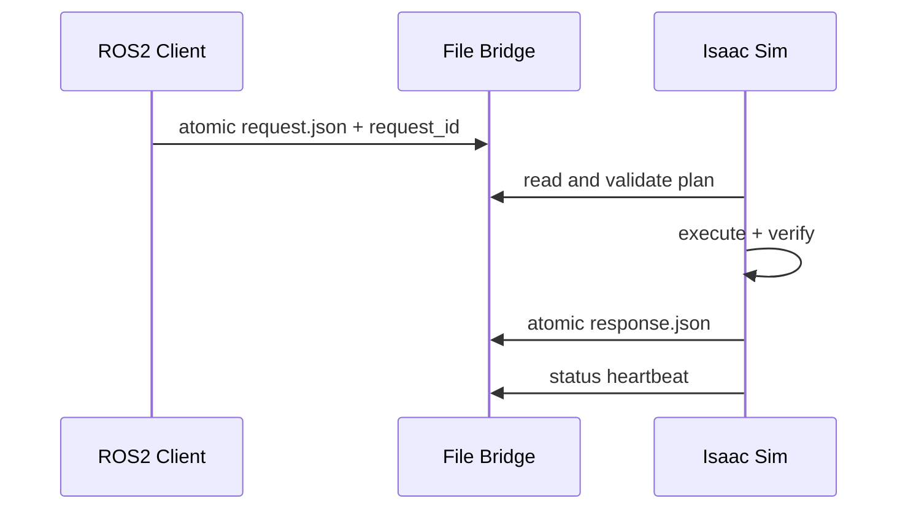

## 文件桥接解决的是边界

AuraVLA 的 ROS 2 进程与 Isaac Sim 位于不同执行环境，任务桥接使用 JSON 文件作为窄接口：客户端写入 `request.json`，Isaac 侧读取并执行，结果写入 `response.json`，状态写入 `status.json`。

协议核心是 `request_id`。Isaac 侧只处理尚未消费的请求，处理后将同一 ID 写回响应，避免进程重启时重复执行旧动作。

## 原子写入与 Owner Token

正式 JSON 不直接覆盖，而是先写入 `.tmp` 文件，再使用 `os.replace()`。读端要么看到旧的完整对象，要么看到新的完整对象，不会读到半个 JSON。

Isaac 启动时生成随机 `owner_token` 并写入 `bridge.owner`。轮询前检查 token，只有当前进程仍持有所有权才消费请求；它约束的是当前单机桥接，不是完整的分布式锁。

状态心跳约每秒更新，包含 `ready`、`state`、`last_request_id` 和 `last_success`。客户端要区分 `ready=false`、`executing`、`error` 与正常 idle。

## 运行时恢复

`IsaacRuntimeLauncher` 启动前设置 `AURA_VLA_ROOT`、桥接目录、相机目录和 URDF 路径，并清理已加载的 `aura_isaac_bridge` 模块缓存。连接失败、非 JSON 返回、脚本异常和 ready 超时分别报告，不能统一吞成“Isaac 未启动”。

## 稀疏关键姿态与双臂执行

`SparseKeyposeDiffuser` 接收稀疏笛卡尔或关节关键姿态，再生成稠密路径。笛卡尔路径按约 `0.04 m` 间距插值，关节路径限制单步变化并保留最少帧数。每个规划段使用 minimum-jerk 参数：

$$
s(p)=p^3(10-15p+6p^2),\quad p\in[0,1]
$$

每段独立减速到端点，避免关节空间插值以非零速度穿过 RRT 转角，导致腕部冲击或被抓物体滑落。双臂路径先同步帧数，再逐帧检查 TCP 最小间距；路径非有限或间距不足时直接拒绝。

## 验证清单

- `request_id` 非空且未被消费；
- response 与请求 ID 对应；
- status 在执行超时前持续更新；
- 双臂路径帧数一致且 TCP 间距通过；
- 仿真异常后写出失败 response，而不是留下 `executing` 状态；
- 任务结束后清理调试轨迹，避免旧路径污染下一次场景。

这套设计的重点不是文件桥接吞吐，而是让进程边界、任务幂等、运行时恢复和轨迹安全检查都成为可观察协议。
